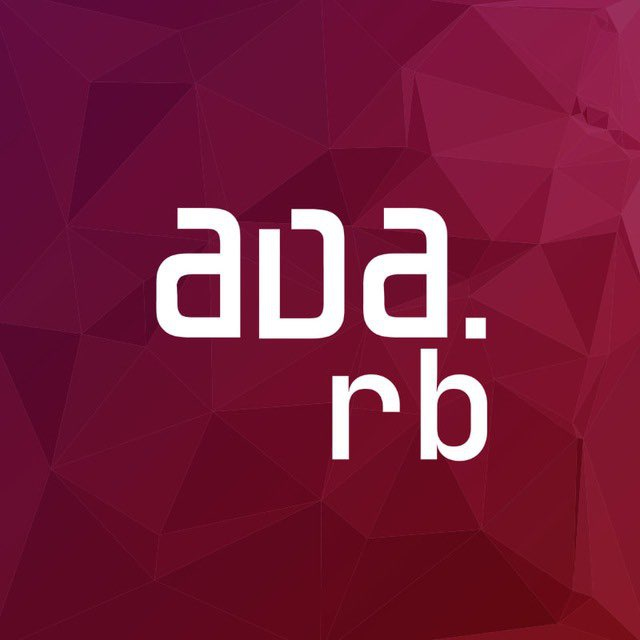
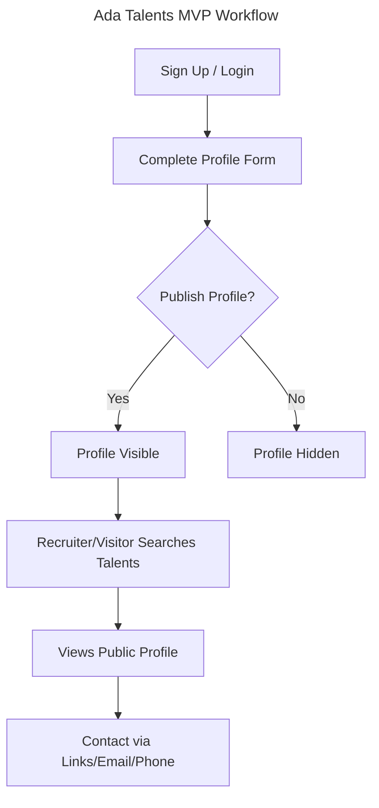

# Ada.rb Talents

> A curated and searchable space for the Ruby community, made by and for developers.

## About

Ada.rb Talents is a lightweight, community-powered directory platform for Ruby on Rails developers from the Ada.rb community. It helps developers showcase their skills and makes it easier for companies and recruiters to find relevant Ruby talent—without job boards, spam, or middlemen.

## Technologies Used

| Component   | Technology                |
|:------------|:--------------------------|
| Backend     | Ruby (3.4+), Rails 8      |
| Frontend    | Tailwind CSS, DaisyUI     |
| Realtime/UX | Hotwire (Turbo, Stimulus) |
| Database    | SQLite (for MVP)          |
| Build Tools | esbuild, Yarn, Node.js    |

- **Key Ruby Gems:** rails, propshaft, puma, jsbundling-rails, turbo-rails, stimulus-rails, cssbundling-rails, jbuilder, solid_queue, solid_cache, kamal
- **Key JS/CSS:** tailwindcss, daisyui, @hotwired/turbo-rails, @hotwired/stimulus

## Requirements

- Ruby 3.4+
- Node.js 18+
- Yarn 1.22+
- SQLite 3

## Installation Instructions

```bash
# Clone the repository
$ git clone https://github.com/yourusername/adarb_talents.git
$ cd adarb_talents

# Install Ruby dependencies
$ bundle install

# Install JavaScript dependencies
$ yarn install

# Set up the database
$ bin/rails db:setup

# (Optional) Build CSS assets
$ yarn build:css
```

## Usage Instructions

```bash
# Start the Rails server (with Hotwire/Tailwind in dev)
$ bin/dev
```

- Visit [http://localhost:3000/talents](http://localhost:3000/talents) to view the public directory.
- Sign up, complete your profile, and toggle visibility to publish.

## Features

- Developer-controlled profiles (create, edit, publish/unpublish)
- Public, searchable developer directory
- Search and filter by skills, location, experience, and keywords
- Public profile pages with contact info (if public)
- Authentication via email/password (Rails 8 native)

## MVP Workflow



## Contributing Guidelines

We welcome contributions from the community!

1. Fork the repository and create your branch from `main`.
2. Follow project code style and naming conventions.
3. Write clear, concise commit messages (see [Conventional Commits](https://www.conventionalcommits.org/)).
4. Add or update tests as needed.
5. Open a pull request with a clear description and reference any related issues.

> 💡 **Tip:** Please read the [Product Requirements](.cursor/rules/guidelines.mdc) before proposing major changes.

## License

This project is licensed under the MIT License.

---

> ℹ️ **Note:** Ada Talents is a community-driven project for the Ada.rb Ruby community in Brazil. Feedback and suggestions are always welcome!
